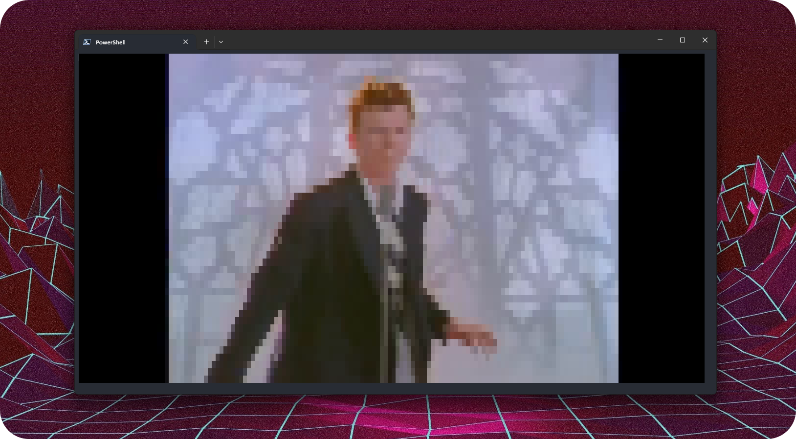

# TermVideo 🎬


Play your videos from a terminal with audio! 🚀

## Description

TermVideo is a terminal video player written in Go that will help you play your favorite videos in a terminal. Supports Windows, Mac and Linux.

## Features

- Play videos with audio
- Customize video's quality
- Colored terminal output
- Youtube video support

## Usage

### Installation

1. Install 
2. Go to the  tab
3. Download the latest release file for your OS

### Example Usage

#### Open a local file in quality 8
```bash
termvideo -q 8 Rickroll.mp4
```

#### Play a YouTube video
```bash
termvideo https://www.youtube.com/watch?v=dQw4w9WgXcQ
```

## Goals
* ❌ Fix some audio issues
* ❌ Improve performance
* ❌ Add comments
* ✅ Improve README.md

## Contributing

Feel free to contribute by opening issues or submitting pull requests. Your input is highly appreciated! 🙌

## Honorable mentions 🙏
- [AlexEidt/vidio](https://github.com/AlexEidt/Vidio) for the video processing library.
- [AlexEidt/aio](https://github.com/AlexEidt/aio) for the audio processing library.
- [ytdl-org/youtube-dl](https://github.com/ytdl-org/youtube-dl) for the youtube video downloading.

## License

This project is licensed under the [MIT License](https://choosealicense.com/licenses/mit/).
